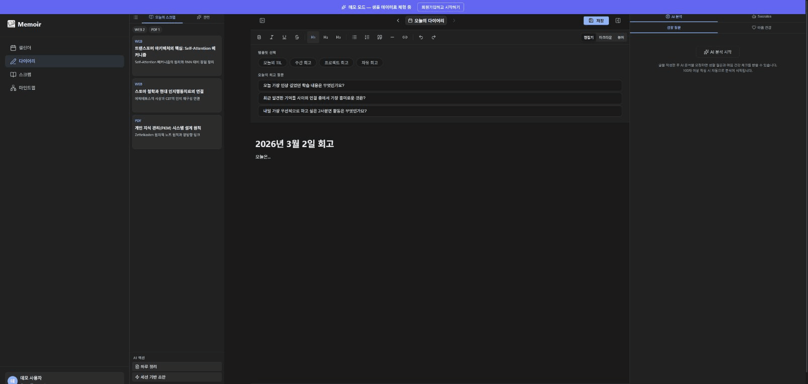

# Memoir AI

> A personal app for capturing what you read, think, and write — and making sense of it over time.

[](https://memoir-knowledge.vercel.app/demo)
[](LICENSE)
[](https://github.com/Danwoo/memorial/actions)

**[한국어](#한국어)** · [**Live Demo →**](https://memoir-knowledge.vercel.app/demo) · [**Issues**](https://github.com/Danwoo/memorial/issues)

---



---

Write diary entries, save web articles and PDFs, then talk to **Socrates** — an AI agent that searches your own notes to answer questions and prompt reflection. A 3D knowledge graph maps how your content connects over time.

Built with React + FastAPI and a two-agent LangGraph system (Socrates for dialogue, Librarian for retrieval) using GraphRAG over Supabase pgvector and KuzuDB.

[Try the demo →](https://memoir-knowledge.vercel.app/demo) — no account needed.

---

## Features

| Feature | Description |
|---|---|
| **Calendar** | See what you read and wrote on any day — diary entries, scraps, and AI-generated tags on a monthly view |
| **Diary** | Write daily entries in a rich text editor; AI suggests reflection questions and generates a daily summary |
| **Scrap** | Save any URL, text, or PDF; AI auto-tags and summarizes, and flags duplicate content |
| **Mindmap** | 3D graph showing how your diary entries and saved scraps connect to each other |
| **Socrates** | Multi-turn AI conversation that retrieves context from your own notes via GraphRAG |

---

## Quick Start

**Prerequisites:** Node.js 20+, Python 3.11+, [`uv`](https://docs.astral.sh/uv/) (Python package manager)

```bash
# Frontend
cd frontend && npm install && npm run dev     # → localhost:5173

# Backend
cd backend
cp .env.example .env                          # fill in your API keys
uv sync
uv run uvicorn app.main:app --reload          # → localhost:8000
```

Required: `SUPABASE_URL`, `SUPABASE_SERVICE_ROLE_KEY`, and either `OPENROUTER_API_KEY` or `GOOGLE_API_KEY`. See [`.env.example`](.env.example) for all options.

---

## Tech Stack

| | |
|---|---|
| **Frontend** | React 18, TypeScript, Vite, Tiptap, react-force-graph-3d |
| **Backend** | FastAPI, Python 3.11, LangGraph |
| **LLM** | OpenRouter (Solar Pro 3) · Gemini fallback |
| **Database** | Supabase (PostgreSQL + pgvector), KuzuDB |
| **Auth** | Supabase Auth — Google / Kakao OAuth |
| **Deploy** | Vercel · Render |

---

## Architecture

```
┌──────────────────┐     ┌────────────────────────────────────┐
│   React SPA      │────▶│   FastAPI (Render)                 │
│   (Vercel)       │     │                                    │
│                  │     │  ┌──────────────┐  ┌───────────┐  │
│  Diary / Scrap   │     │  │   Socrates   │  │ Librarian │  │
│  Mindmap         │     │  │  (LangGraph) │  │(LangGraph)│  │
│  Socrates        │     │  └──────┬───────┘  └─────┬─────┘  │
│  Calendar        │     │         └────────┬────────┘        │
└──────────────────┘     │    ┌─────────────▼──────────────┐  │
                         │    │  Supabase (PostgreSQL +     │  │
                         │    │  pgvector + Auth)           │  │
                         │    └────────────────────────────┘  │
                         │    ┌────────────────────────────┐  │
                         │    │  KuzuDB (Knowledge Graph)  │  │
                         │    └────────────────────────────┘  │
                         └────────────────────────────────────┘
```

---

## 한국어

일기 작성, 웹 콘텐츠 저장, AI 대화를 하나로 통합한 개인 지식 관리 앱입니다. **소크라테스** 에이전트가 저장된 다이어리와 스크랩을 GraphRAG로 검색해 맥락 기반 대화를 제공합니다.

React + FastAPI 풀스택, LangGraph 기반 멀티 에이전트 시스템(소크라테스 + 라이브러리언), Supabase pgvector + KuzuDB로 구성되어 있습니다.

| 기능 | 설명 |
|---|---|
| **캘린더** | 날짜별 다이어리·스크랩·AI 태그를 월간 뷰로 확인 |
| **다이어리** | 리치 텍스트 에디터 + AI 회고 질문 + 일간 요약 |
| **스크랩** | URL·텍스트·PDF 저장 → AI 자동 태그·요약·중복 감지 |
| **마인드맵** | 다이어리와 스크랩 간 연결을 3D 그래프로 시각화 |
| **소크라테스** | 내 노트 기반 GraphRAG 멀티턴 AI 대화 |
