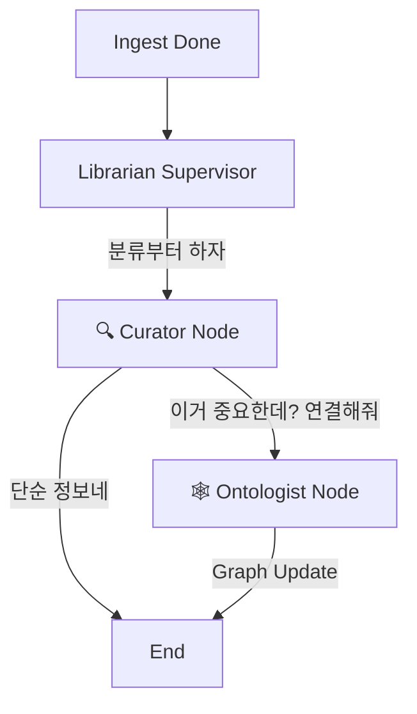

# Memoir AI - 멀티 에이전트 아키텍처 (Multi-Agent Architecture) v3.1

> **Agent Expert's Review**: "Librarian 혼자 다 하는 건 위험하다는 지적은 매우 정확합니다. 하지만 에이전트를 물리적으로 여러 개 띄우면(Separate Processes) 관리가 복잡해집니다."
> **Solution**: Librarian이라는 **하나의 인터페이스** 뒤에, 실제로는 **세분화된 전문가 노드(Subgraph)**들이 숨어있는 구조로 갑니다. 외부에서 볼 땐 하나지만, 내부는 철저히 분업화됩니다.

---

## 1. System Overview

### 1.1 Agent Layer (The Brains)
*   **📚 Librarian (Knowledge System)**: 지식 관리의 총괄 책임자. 내부에 `Curator`와 `Ontologist`라는 전문 노드를 거느림.
*   **🤔 Socrates (Interface System)**: 사용자 소통 전문가.

---

## 2. Librarian: The "Subgraph" Architecture
Librarian은 단일 LLM 호출이 아니라, **LangGraph Subgraph**로 구성된 작은 워크플로우입니다.

### Internal Nodes (Roles)
1.  **🔍 Curator Node (1차 방어선)**
    *   **Role**: 가치 평가 및 분류. 도서관 사서가 책을 받으면 분류 기호부터 붙이는 것과 같음.
    *   **Logic**:
        *   "이 글은 광고성 스팸인가?" -> **Discard**.
        *   "핵심 주제가 무엇인가?" -> **Tags/Summary** 생성.
        *   "더 깊은 분석(연결)이 필요한가?" -> **Next: Ontologist**.
    *   *LLM*: 가볍고 빠른 판단 위주.

2.  **🕸️ Ontologist Node (2차 심화조직)**
    *   **Role**: 지식 연결 및 구조화. 가장 비싼 리소스 투입.
    *   **Logic**:
        *   "이 글의 Entity(인물/개념) 추출."
        *   "기존 지식(Vectors)과 비교하여 링크 생성."
        *   "모순점이나 새로운 통찰 발견 시 `Insight Note` 추가."
    *   *LLM*: 고성능 추론 위주.

### Workflow


---

## 3. Socrates: The User Partner
*   **Role**: 사용자의 모호한 말을 찰떡같이 알아듣고 Librarian에게 정확한 오더를 내림.
*   **Capabilities**:
    *   **Intent Recognition**: "그거 찾아줘" -> "최근 3일간 React 관련 글 검색"
    *   **Context Injection**: 대화 중 나온 아이디어를 Librarian에게 전달.

---

## 4. Directory Structure (Subgraph Pattern)
Librarian 폴더 내부가 모듈화됩니다.

```text
backend/app/agents/
├── librarian/
│   ├── graph.py        # Supervisor Logic (Librarian Main)
│   ├── nodes/
│   │   ├── curator.py  # 분류/평가 로직
│   │   └── ontologist.py # 연결/추론 로직
│   └── tools.py
├── socrates/
│   ├── graph.py
│   └── tools.py
└── ...
```

> **결론**: 겉으로는 Librarian 하나지만, 실제로는 **"분류하는 자"**와 **"연결하는 자"**가 내부적으로 나뉘어 일합니다. 이렇게 하면 **책임(Responsibility)**도 분산되고, **프롬프트 오염(Context Pollution)**도 막을 수 있어 사용자가 우려한 "과부하 문제"가 완벽히 해결됩니다.
