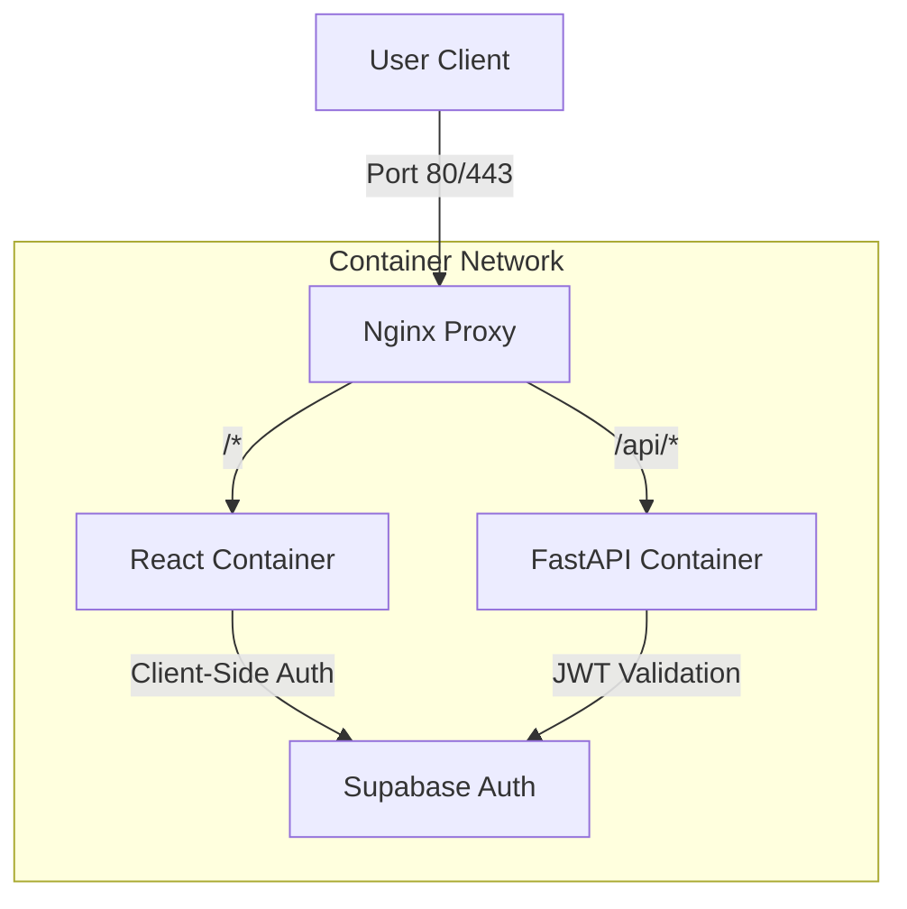

```
# Memoir AI - 기술 명세서 (Tech Spec)

## 1. 시스템 아키텍처 개요 (System Architecture)

**"비용 효율성"**과 **"배포 유연성"**을 핵심으로 합니다. 모든 인프라는 로컬에서 **Docker Compose**로 관리되며, 언제든 저렴한 VPS(AWS Free Tier, Oracle Cloud 등)로 이전할 수 있도록 컨테이너화합니다. DB는 초기 비용이 들지 않는 **Managed Service의 Free Tier**를 적극 활용합니다.

### High-Level Architecture

---

## 2. 기술 스택 선정 (Tech Stack Selection)

### 2.1 Frontend (Container A)
*   **Framework**: **React** (Vite) + TypeScript
*   **Env**: Node.js Alpine Image
*   **Deployment**: 정적 빌드 후 Nginx 서빙 혹은 Node 서버 실행.
*   **State Management**: **TanStack Query (React Query)**
    *   *선정 이유*: 서버 상태(API 데이터)와 클라이언트 UI 동기화에 최적화.
    *   *Polling Strategy*: `status: 'processing'` 인 메모리에 대해 `refetchInterval: 5000` (5초) 설정. 완료 시 Polling 중단 (UX 저해 방지).
*   **Styling**: **Tailwind CSS**
    *   *선정 이유*: 빠른 스타일링 및 커스터마이징 용이.
*   **Visualization**: **react-force-graph-2d**
    *   *선정 이유*: Canvas 기반으로 대량의 노드 렌더링 성능이 우수하며, 'Premium'한 인터랙션 커스터마이징 가능.

### 2.2 Backend (Container B)
*   **Framework**: **FastAPI** (Python 3.10+)
*   **Env**: Python Slim Image
*   **Libs**: `langchain`, `pydantic`, `supabase`, `neo4j-driver`

### 2.3 Database Strategy (Free Tier Optimized)
"가난한 개발자"를 위한 최적의 무료 조합입니다. 관리 포인트는 줄이고 기능은 다 챙깁니다.

1.  **Main DB**: **Supabase (Free Tier)**
    *   **제공량**: 500MB Database space, 5GB Bandwidth. (텍스트 위주이므로 충분)
    *   **기능**: Auth, Postgres, pgvector(벡터 검색).
2.  **Graph DB**: **Neo4j AuraDB (Free Tier)**
    *   **역할**: 지식 그래프(Node & Edge) 저장 및 탐색. **보조 기억장치**로 활용.
    *   *선정 이유*: 복잡한 관계 추론(Reasoning)을 위해 Librarian 에이전트가 활용.
    *   *Hybrid Safety*: 핵심 연결 정보는 Supabase에도 백업하여 Graph DB 장애 시 대응.

### 2.4 Security & Network Strategy (New)
*   **Authentication Middleware**:
    *   FastAPI에 `SupabaseAuthMiddleware`를 구현.
    *   HTTP Header의 `Authorization: Bearer <token>`을 파싱하여 Supabase Auth 서버 검증 혹은 `JWT Secret`으로 로컬 서명 검증 수행.
    *   Vite는 빌드 타임(`npm run build`)에 환경 변수가 주입됩니다.
    *   따라서, **환경별(Local/Dev/Prod)로 Docker Image를 별도 빌드**하는 전략을 채택하여 불확실성을 제거합니다.
*   **Reverse Proxy (Nginx)**:
    *   Docker Compose 최상단에 Nginx를 배치하여 Entrypoint를 단일화.
    *   **CORS 문제 완전 해결**: 프론트와 백엔드가 같은 도메인(Origin)으로 취급됨.

---

## 6. 데이터 및 컨벤션 (Conventions)
*   **Timezone**: 모든 DB 저장 시간은 **UTC**를 기준으로 하며, 프론트엔드 렌더링 시 사용자의 로컬 타임존으로 변환합니다.

---

## 3. 핵심 기능 구현 세부 전략 (Python Backend 중심)

### 3.1 Multi-modal Scout (수집 - Service Layer)
이 기능은 AI 에이전트가 아닌 **결정론적(Deterministic) 파이프라인**으로 구현합니다.
*   **Endpoint**: `POST /api/ingest`
*   **Logic**:
    *   **Web**: `@mozilla/readability` + `jsdom`으로 본문 추출.
    *   **PDF**: **Upstage Document Parser API** 활용.
    *   전처리된 텍스트를 임베딩하여 Vector DB 저장 후, **Librarian 에이전트 트리거**.

### 3.2 Socrates & Librarian (Agent Layer)
*   **Engine**: LangGraph
*   **Socrates**: "Mouth & Ear". 사용자 의도를 파악하고 Librarian에게 지식을 요청.
*   **Librarian**: "Brain". 저장된 지식을 뒤져(Search) 연결(Link)하고 정제(Curate)함.
*   **Output**: 대화 종료 시, 대화 내용을 요약하여 노트의 `user_insight` 필드에 업데이트.
*   **Logic**:
    *   FastAPI의 `StreamingResponse`를 활용하여 LLM 토큰 실시간 전송.
    *   LangChain의 `ConversationBufferMemory` 등을 활용해 대화 맥락 유지.
    *   *Stability*: `async generator` 내에서 **Client Disconnect** 감지 시 즉시 루프 중단하여 비용 누수 방지.

### 3.3 Auto-Ontology Mapping (연결 & 일관성)
*   **Processing**: 백그라운드 작업 (FastAPI `BackgroundTasks` + **Supabase `task_queue`**)
    *   *Persistence*: 서버 재시작 시 작업 유실 방지를 위해 RDB에 `PENDING` 상태로 작업 기록 후 처리.
*   **Consistency Strategy (Eventual Consistency)**:
    *   *Expert Opinion*: "Supabase와 Neo4j 간의 분산 트랜잭션(2PC)은 구현하지 않습니다. 따라서 네트워크 결함 시 불일치는 필연적(100%)으로 발생합니다."
    *   *Solution*: 우리는 이를 **'결과적 일관성(Eventual Consistency)'** 모델로 해결합니다.
        1.  RDB(Supabase) 저장은 동기적으로 1차 성공 보장.
        2.  Graph(Neo4j) 작업은 `task_queue` 테이블에 `PENDING`으로 기록.
        3.  Background Worker가 `PENDING` 작업을 처리하고 `COMPLETED`로 변경.
        4.  실패 시 `FAILED` 상태로 남고, 사용자가 "재시도" 버튼을 누르거나 크론잡이 재처리.
        *   *Result*: "잠시 깨질 순 있어도, 영원히 깨지진 않는다."

---

## 4. 로컬 개발 및 배포 워크플로우
1.  **개발**: `docker-compose up` 한 방으로 프론트/백엔드 동시 실행. (Hot Reloading 설정 포함)
2.  **DB 연결**: `.env` 파일에 Supabase URL/Key, Neo4j URL/User/PW 만 입력하면 끝.
3.  **배포**:
    *   클라우드 VM 생성 (Docker 설치).
    *   프로젝트 Clone 및 `.env` 설정.
    *   `docker-compose up -d --build`.
